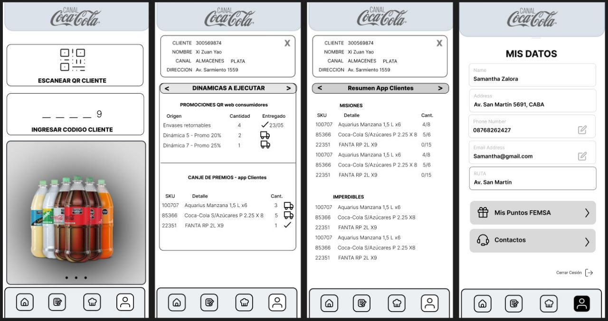
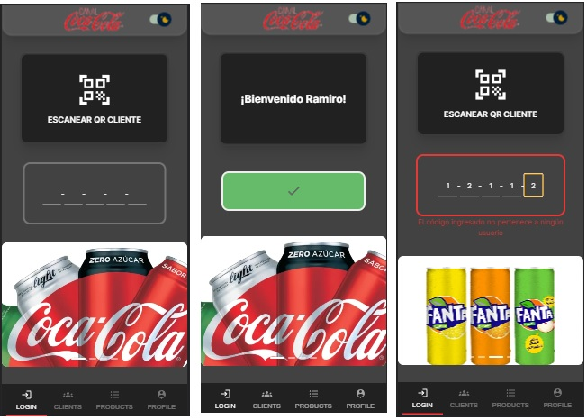
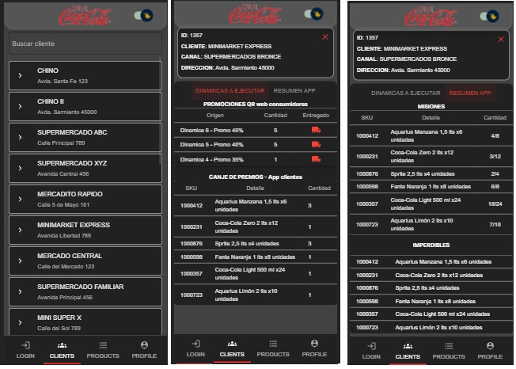
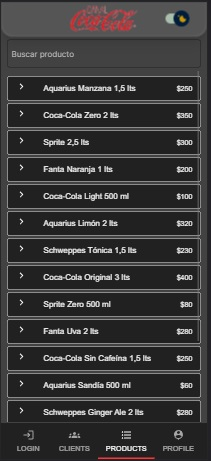
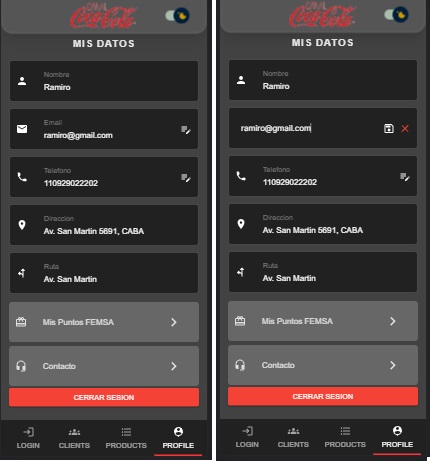

### Indice:

<ul>
<li> <a href="#intro">- Intro</a>
<li> <a href="#obj">- Objetivos del Proyecto</a></li>
<li> <a href="#stack">- Stack de tecnologias</a></li>
<li> <a href="#instrucciones">- Instrucciones para comenzar</a></li>
<br>
<li> <a href="#back">- Backend</a>
  <ul>
    <li><a href="#endpoints">Endpoints</a></li>
  </ul>
</li>
<li> <a href="#front">- Frontend</a>
 <ul>
    <li><a href="#login">Acceso</a></li>
    <li><a href="#clients">Clientes</a></li>
    <li><a href="#products">Productos</a></li>
    <li><a href="#profile">Perfil</a></li>
  </ul>
</li>
<li> <a href="#extras">- Extras</a></li>
</ul>

<span id="intro"></span>

## Intro

El objetivo es crear una app unicamente para mobiles que replique el funcionamiento del actual "Canal Coca Cola"(aplicacion exclusiva para vendedores de la linea de productos "Coca Cola"), para Desktop se debe mostrar una pantalla de que no se puede utilizar la app en escritorio:

Ejemplo a replicar:

<p align="left"><p>
<span id="obj"></span>

### Objetivos del Proyecto:

- Construir el frontend en React que muestre la información expuesta por la API sobre los clientes de cada usuario en el backend.
- La app debe estar conectada con el backend de Blive.
- Proporcionar la opción de inicio de sesión mediante el escaneo de un código QR que contenga el código de usuario correspondiente.
- Al autenticarse, renderizar los datos de canjes y estadísticas de cada cliente asociado al usuario.
- Crear una pantalla de perfil del usuario donde se pueda visualizar y editar la información personal.

<span id="stack"></span>

### Stack

- Next.js
- Tailwind CSS
- Git

  <span id="instrucciones"></span>

### Iniciar:

1.  En la carpeta raiz crear un archivo llamado: `.env.local` que tenga la siguiente variable de entorno:
    `NEXT_PUBLIC_SECRET_TOKEN = secret-token` (\*)

2.  Instalar dependecias ingresando en nuestro terminal el comando segun empaquetador:

```bash
- npm install
- pnpm install
- yarn install
```

3. Inicializar ingresando el comando segun empaquetador:

```bash
- npm run dev
- pnpm run dev
- yarn dev

```

(\*) La variable de entorno "NEXT_PUBLIC_SECRET_TOKEN" simula un token para poder acceder a la ruta de usuarios.

# Backend

Deploy: ....

El backend de la aplicación está desarrollado en Next.js. La base de datos se simula utilizando archivos JSON, lo que permite almacenar y acceder a los datos de manera eficiente sin requerir una base de datos tradicional.

<span id="endpoints"></span>

## Endpoints

| Método | Endpoint                       | Descripción                   | Headers                     |
| ------ | ------------------------------ | ----------------------------- | --------------------------- |
| GET    | /api/users                     | Traer todos los usuarios      | Authorization: secret-token |
| GET    | /api/users?password={password} | Traer un usuario con password | Authorization: secret-token |
| GET    | /api/clients                   | Traer todos los clientes      | -                           |
| GET    | /api/clients?id={id}           | Traer un cliente por id       | -                           |
| GET    | /api/products                  | Traer todos los productos     | -                           |
| GET    | /api/products/missions         | Traer todas las misiones      | -                           |
| GET    | /api/products/unmissables      | Traer todos los imperdibles   | -                           |

<span id="front"></span>

# Frontend

El frontend de la aplicación está construido en Next.js y utiliza Tailwind CSS para los estilos de la interfaz. Además, se emplea el uso de Context de React para gestionar el estado del usuario logueado y permitir el cambio de tema de la aplicación.

Deploy: ....

<span id="login"></span>

### Login:

- Al ingresar a la aplicación, encontrarás un navbar en la parte superior que incluye el logo y un interruptor para cambiar entre el modo claro y oscuro de la aplicación. En la parte inferior, hay un appbar que te permite navegar por las diferentes secciones de la aplicación siempre y cuando estés logueado.
Al inicio, serás dirigido a la sección de "login", donde podrás acceder utilizando la contraseña numérica de un usuario. Tienes la opción de ingresar manualmente la contraseña o escanear un código QR que contenga la clave de acceso para facilitar el acceso.
A continuación, se proporcionan algunos códigos de prueba que puedes utilizar para realizar las pruebas.
`12345` `67890` `23456` `78901` `34567`
<div style="display: flex;">
  <div>
    
  </div>
  <div>
    
  </div>
</div>

<p align="left"><p>

<span id="clients"></span>

- Una vez que hayas iniciado sesión, serás redirigido automáticamente a la siguiente sección de la aplicación, donde se mostrará un listado de clientes obtenidos desde el backend. En esta sección, tendrás la capacidad de filtrar los clientes por nombre y acceder a los detalles específicos de cada cliente seleccionado, como promociones, canjes, misiones y elementos imperdibles.

<p align="left"><p>

<span id="products"></span>

- La tercera sección de la aplicación es la de productos, donde podrás encontrar los detalles y precios de los diferentes productos disponibles. Además, tendrás la capacidad de utilizar un buscador para filtrar los productos según tus preferencias.

<p align="left"><p>

<span id="profile"></span>

-Finalmente, tenemos el apartado de perfil de usuario, donde se muestra la información del usuario logueado. En esta sección, tendrás la capacidad de editar el correo electrónico y el teléfono del usuario (es importante destacar que esta funcionalidad es simulada, ya que no contamos con una base de datos y los cambios se realizarán en el estado local del navegador).
Además, encontrarás dos botones sin funcionalidad específica en la parte inferior, seguidos de un botón para cerrar sesión.

<p align="left"><p>

<span id="extras"></span>

## Extras

- Listado de clientes: Se muestra un listado de clientes obtenidos del backend, lo que permite visualizar información general de cada cliente.

- Listado de todos los usuarios: Se muestra una lista completa de todos los usuarios registrados en el sistema. Esto brinda una visión general de todos los usuarios y permite acceder rápidamente a la información relevante de cada uno.

- Búsqueda de cliente por ID: Se proporciona la capacidad de buscar un cliente específico utilizando su ID, lo que facilita el acceso a los detalles del cliente.

- Listado de productos: Se muestra un listado de productos disponibles, lo que permite ver información relevante sobre cada producto.

- Cambio de tema claro/oscuro: Se incluye un interruptor que permite cambiar entre los modos claro y oscuro de la aplicación, brindando a los usuarios la opción de personalizar su experiencia visual.
